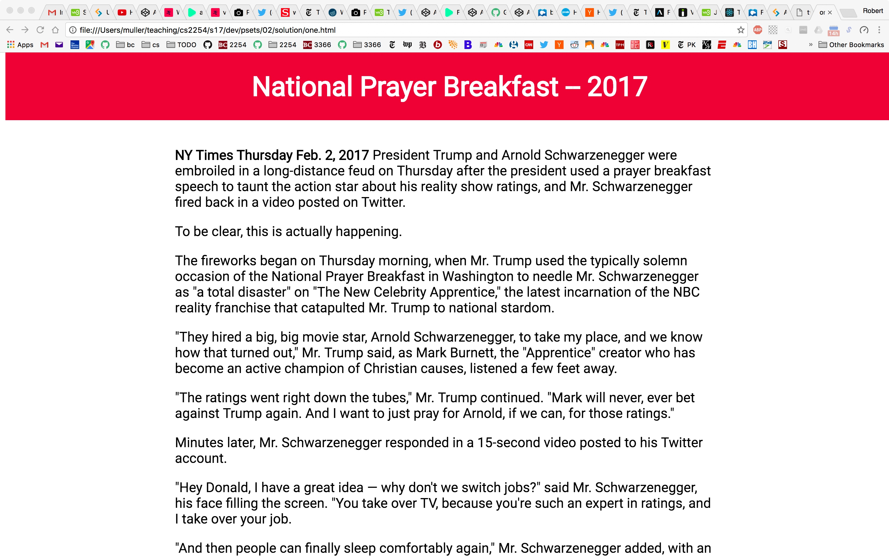
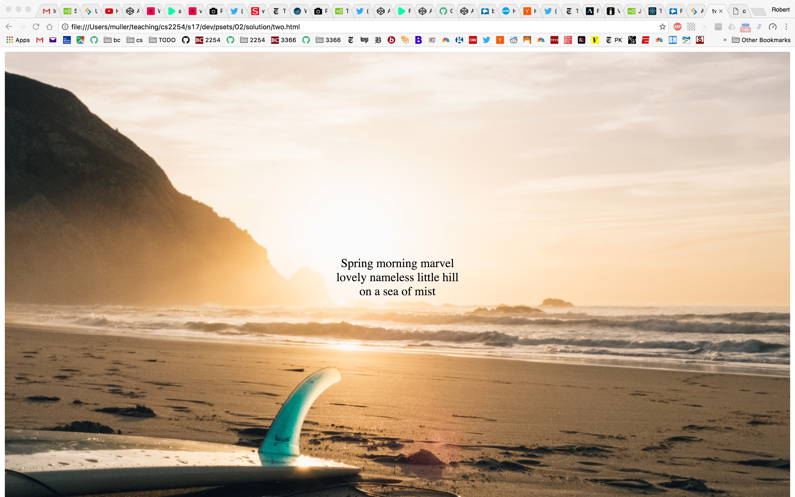

# CSCI 2254 Web App Development

## Problem Set 2: CSS, HTML & JS

#### (10 Points) Due via GitHub push: Friday February 10, 11:59PM.

---

This is a three-part problem set. The first part involves CSS, the second involves CSS, HTML and a bit of JavaScript. The third part is simple markdown.

---

## Part 1 (3 Points): Header

In this problem, you're required to create two files: **one.html** and **one.css**. The definitions in **one.css** should be such that the elements defined in the **one.html** file can create a two-part document, including:

1. a **header** element that is at a **fixed** position at the top of the page, and

2. a scrollable **content** section of text below with narrowed margins (250px in the example picture below).

The header and the content can contain anything at all. The example below shows a news item from the NYT, February 2, 2017. The header is in red and white with a centered H1 title. Although it can't be seen from a static picture, the content below the header *scrolls* underneath the header.




---

## Part 2 (5 Points): Haiku##

In this problem, you are to use CSS, HTML and JavaScript to create a *Haiku* generator. As you might know, Haiku is an ancient form of Japanese poetry. For this problem, we'lll be using the 5/7/5 variation, i.e., a poem is exactly three lines long, with the first line made up of words containing exactly 5 syllables, the second line is made of words containing exactly 7 syllables and the third and final line is made up of words containing a total of exactly 5 syllables. See the example below.



Your solution to this problem will involve the creation of 3 files:

1. three.html
2. three.css
3. three.js

The CSS file should create a full-spread splash page with an image of a beach as shown above. The page shown above is borrowed (under fair-use) from the inimitable [Travis Neilson](http://travisneilson.com/) of DevTips fame. You should first watch [Travis' video](https://www.youtube.com/watch?v=hExwnLlj2xk) on how to make a full-screen landing page. What is required over and above what is shown in Travis' video is JavaScript code that will generate and place a *randomly generated Haiku poem* in the center of the landing page.

In order to solve this problem, you'll probably want to create an array of words that will make up your poems. For each word, you'll want a string representation of the word together with an integer specifying how many syllables the word contains. One might think of a JS structure such as

```javascript
var dict = [{word:"Boston", syllables:2}, {word:"subliminal", syllables:4}, ... ]
```

A word can be selected from such an array using JavaScript's library function `Math.random` which returns a number greater than 0 and less than 1. This floating point number can be converted into an appropriate integer using the function:

```javascript
function getRandomInt(max) {
  return Math.floor(Math.random() * max);
}
```

Of course, some work is required to ensure that the words used to make up a particular line have syllables adding up to the required number. For example, if the first randomly chosen word for line 1 is, say, "Baltic", then the remaining words for line 1 must contain exactly 3 syllables. This may require a repetitive process to ensure that that a suitable word can be found. 

When the words (i.e., strings) making up a given line are found, they can be concatenated using the "+" operator. It's up to you, how the three lines are placed on the page. (Using <span>? Three consecutive headers?, etc.)

------

## Part 3 (2 Points): Markdown

This problem is quite simple. Create a new markdown file **PS2.md** that describes your solutions to parts 1 and 2 of this problem set. Your markdown should be placed in the root folder of your repository and should be such that a new person coming onto the project could read it to gain a good understanding of what you did to solve parts 1 and 2 and why.


